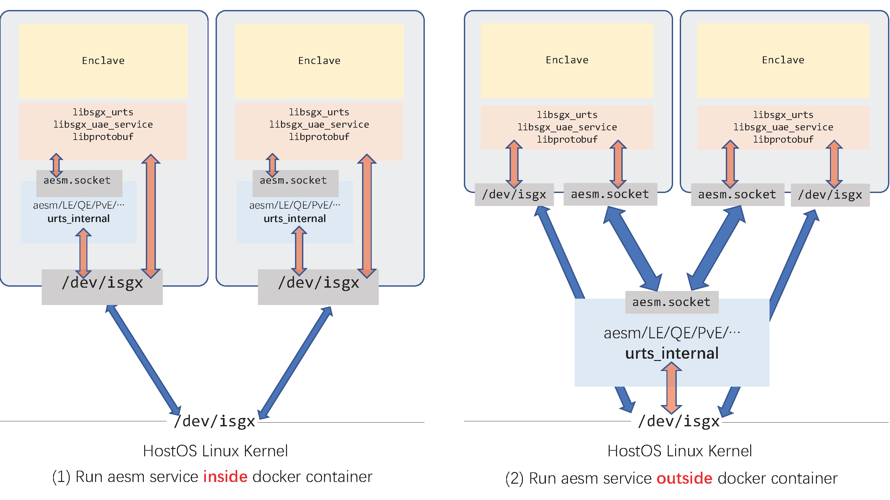

[SGXfail](https://github.com/dingelish/SGXfail)

基于teaclave的项目：

- [Ekiden](https://arxiv.org/abs/1804.05141)
- [Engima](https://github.com/enigmampc/enigma-core)
- [Chainlink](https://github.com/smartcontractkit/chainlink)

简单的说 Intel SGX 试图在用户相信Intel的前提下保证：

- 编译生成的 enclave.sign.so 是目前正在运行的这个 enclave.sign.so
- 这个 SGX enclave 里的 secret 不会通过非 side channel 泄露出去
- 这个 enclave 具体跑在哪个 platform (=CPU+mb) 上是不可知的

但是这不包括：

- 我写下的代码是正在运行的代码。这需要一个诚实的编译器，和许多诚实的库。不是SGX的事。
- SGX enclave会一直工作。因为它毕竟还是依赖于内核分配资源给他。内核不分配内存，线程被杀死这种事一旦发生，enclave也会停下来的。
- 保证 enclave 拿到的“外界输入”都是正确的。试想一下，如果把一个python解释器放进SGX enclave，在解释执行的python源代码中写下 import os 的时候会发生什么？Python解释器会去文件系统中找到os并把它读进内存。然而SGX的信任边界并不能保证这个读进来的os是被期待的os！任何攻击者都可以篡改这个os导致在enclave里执行恶意逻辑！（那些在enclave里把syscall包一层从而支持任意程序的在我看来都是“使用SGX”但是没有被SGX保护的典型）。

SGX的一个典型应用就是做多方安全计算（Secure Multiparty Computing）

借助SGX可以构造一个可信的裁判来解决：

- 两个大富翁首先都得相信Intel。
- 两个大富翁需要共同review这个裁判enclave的代码，取得共识，都认为这个enclave是公正的。
- 用两人都认可的编译环境生成enclave.sign.so。
- 把这个enclave在任何SGX执行环境上跑起来。
- 两人分别remote attest这个跑起来的enclave，验证其report是否完全满足安全需求。分别把自己的财产数通过安全的信道传给enclave，enclave做出判断，返回给两人结果。


为了支持这个可信计算环境，Intel做了非常多工作的，大概包括（不限于）：

- 一个精巧的 Memory Encryption Engine，保证了 enclave 内的数据只有 enclave 自身才能访问明文。出了CPU就是密文，就算直接截胡memory bus也听不到有意义的数据。
- 一套基于 EPID 的组签名机制，保证 platform (=CPU+mb)的匿名性。
- remote attestation的IAS支持。
- 一套 trusted/untrusted 的基础库。
- [论坛](https://software.intel.com/en-us/forums/intel-software-guard-extensions-intel-sgx)

有用的资源

- 力推 [Platform Embedded Security Technology Revealed](https://link.springer.com/book/10.1007/978-1-4302-6572-6)。如果对可信计算没概念的话，耐着性子读完这本书会很有帮助！
- Intel SGX [主页](https://software.intel.com/en-us/sgx)
- Intel SGX SDK [主页](https://software.intel.com/en-us/sgx-sdk)
- Intel Open Source 01.org 上的 SGX for linux [主页](https://01.org/intel-softwareguard-extensions) 一般来讲这里更新最快
- Intel 官方的 [linux-sgx-sdk](https://github.com/intel/linux-sgx)
- Intel 官方的 [linux-sgx-driver](https://github.com/intel/linux-sgx-driver)
- 一份 Remote Attestation 实现 [linux-sgx-remoteattestation](https://github.com/svartkanin/linux-sgx-remoteattestation)
- 一百多页的 [Intel SGX Explained](https://eprint.iacr.org/2016/086.pdf) 基本读不完就放弃了
- [SGX-hardware](https://github.com/ayeks/SGX-hardware) 哪些CPU/主板/云厂商提供SGX支持，可以参考。也包含一个检测sgx是否支持/开启的小程序。


Intel SGX 程序通常分成两部分：untrusted和trusted。trusted包括了用户自己写的SGX enclave。用户自己的untrusted app需要和Intel提供的untrusted runtime等运行时库配合使用。

此外，为了支持Intel SGX程序的执行，还需要的东西包括：一个untrusted部分的守护进程aesmd，提供"Application Enclave Service Manager"；几个必备的官方Enclave：Launch Enclave (le), Quoting Enclave (qe), Platform Service Enclave (pse), Provisioning Enclave (pve), Provisioning Certification Enclave (pce), Reference Launch Enclave (ref_le, 2.1.3新增, 具有提供Flexible launch control的能力)；和一些配套的untrusted AE接口。



左图和右图分别是两种在docker里运行SGX程序的结构。图中展示的信息包括：

- SGX的内核驱动暴露一个/dev/isgx的misc device给用户态。用户态的AESM守护进程和uae service等经由这个misc device为用户程序的untrusted部分提供create/destroy enclave等的能力。
- AESM的守护进程aesmd会打开一个domain socket: aesm.socket给用户态程序的urts(untrusted runtime service)库和uae_service库提供支持。AESM对于用户来说“应该是个黑盒子”。用户只需要通过urts和uae_service提供的接口来实现业务逻辑就可以了。

Intel SGX Application Enclave Service Manager(Intel SGX AESM)是Intel SGX的系统组件，主要提供了
SGX Enclave 启动支持，密钥配置，远程认证等服务。


那么从之上的讨论中可以看出：想在真实硬件环境中运行一个SGX程序的前提包括平台提供isgx设备和全套的aesm服务和urts/uae_service的动态库。这里先抛开基于Intel ME提供的PSE不谈，后面再说。

为了方便开发人员，Intel提供了一套软件模拟环境。这套模拟环境可以通过在编译时指定SGX_MODE=SW打开。启用SW环境后，编译时会链接所有库的模拟执行版本，例如libsgx_trts_sim.a, libsgx_tservice_sim.a等。对应的untrusted部分也有模拟环境：libsgx_uae_service_sim.so, libsgx_urts_sim.so. 所以，在没有SGX硬件的支持下，也是可以通过软件模拟的方式来玩SGX的（但是做不了remote attestation，并且没有PSE）。

```
docker pull teaclave/teaclave-build-ubuntu-1804-sgx-2.9.1
docker run --rm -v /your/path/to/teaclave-sgx-sdk:/root/sgx -ti teaclave/teaclave-build-ubuntu-1804-sgx-2.9.1
root@docker:~# cd /root/sgx/samplecode/hello-rust
root@docker:~/sgx/samplecode/hello-rust# SGX_MODE=SW make
```

### Partition, partition, partition

在SGX编程中，partition意味着划分可信/不可信的边界。在Enclave内的代码一般被认为是被信任的代码，在Enclave外的代码一般被认为是不可以被信任的代码。这里一个良好的设计原则是：无论Enclave外的代码如何执行，都不会泄露Enclave内的数据，破坏Enclave内的执行逻辑。因此partition是一个“业务逻辑”层面的事。对于一个业务来说，partition可以有无数种方式，但不恰当的partition会导致SGX程序“似乎被保护了”但是并不可信。

让我们拿Scone-python做例子。Scone（和Graphene SGX）是一类试图将”任意程序“跑在SGX内的解决方案。他们甚至可以直接跑python解释器。看上去很美。但是在SGX的威胁模型下，只有Enclave内是可信的，这导致，在Enclave内执行的python解释器在执行到import numpy的时候，会从磁盘中读取numpy的python文件并进行解释，而读进来的文件是不可信的！这时相当于：在可信环境中执行了不可信的代码，然而——用户依然认为它是可信的！这是一个典型的错误可信计算基的实例。攻击者可以简单的替换磁盘中的numpy，下次用户再次import numpy的时候，就会使用植入了恶意逻辑（比如发送secret）的numpy在Enclave内执行，导致秘密泄露。

回到我们的例子中。我们的prinln!是在哪里切割的呢？这参考了Rust自身的抽象设计。感兴趣的同学可以查看sgx_tstd的源代码。相信你一定会有所发现。

todo: 读sgx_tstd代码

