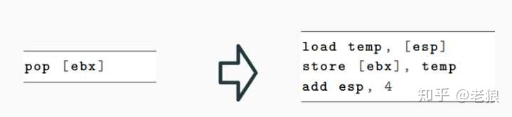
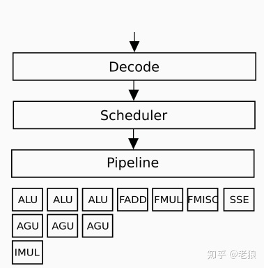

edl
PSW
codes of localattestation, remoteattestation
how run ?
Intel official docs of SGX
linux-sgx-sdk codes of localattestation, remoteattestation
supported compiler?


Secure remote computation (Figure 1) is the problem of executing software on a remote computer owned and maintained by an untrusted party, with some integrity and confidentiality guarantees. In the general setting, secure remote computation is an unsolved problem. Fully Homomorphic Encryption [61] solves the problem for a limited family of computations, but has an impractical performance overhead [140].

todo: 进一步看看, Fully Homomorphic Encryption


An SGX-enabled processor protects the integrity and confidentiality of the computation inside an enclave by isolating the enclave’s code and data from the outside environment, including the operating system and hyper- visor, and hardware devices attached to the system bus.

todo: hypervisor 到底是什么机制？


SGX that forces each computer’s owner to gain approval from a third party (which is currently Intel) for any enclave that the owner wishes to use on the com- puter.

todo: Intel 可以被换掉吗？需要改cpu的micro-code吗？


micro code

现代CPU的指令解码器（Instruction Decode Unit ，IDU）大致分成两种：硬件指令解码器和微码指令解码器。

硬件指令解码器是完全由硬件连线（hardwired)完成的机器代码解码。它是最原始的解码器，由有限状态机驱动，解码速度十分快。它现在还在很多精简指令CPU（RISC）中发挥作用。

我们现在普遍使用的电脑X86 CPU，采用的是复杂指令集（CISC)，指令很多，而且长短不一。如果所有的指令全部采用硬件解码，那将是一个不可能完成的任务。所以一条机器指令，将被拆解成数个类似RISC的精简微操作：微码，Micro-Ops，Microcode。而这些Micro-Ops，则可以完全被硬件执行



那么每个X86指令会被分解成多少个micro-ops呢？这和该指令的复杂程度相关，很简单的指令甚至只有一个micro-ops，一般3个左右，复杂的可以4个以上。

这么做除了能化繁为简外，它的输出Micro-Ops作为可以执行的最小单位，可以被调度器Scheduler放入Pipeline中来提高指令的并行性：



然后才会进入ALU，IMUL等等逻辑运算单元。它们基本是由逻辑门搭出来的。

一条机器指令，经过重重解码，才会流到逻辑运算单元。而这个decode的过程，让曾经泾渭分明的RISC和CISC两种CPU架构的界限变得模糊了起来。RISC CPU加入了越来越多的指令，很多CPU也不再仅仅是硬件指令解码，而对部分指令采取了微码解码方式。而CISC CPU因为加入了Micro-Ops，而在decode后端显示出了RISC的特性。从这个意义上来讲，以ARM为代表的RISC CPU和以X86为代表的CISCCPU在指令集层次很大程度融合了。


According to a 2013 Intel patent [83], the avenues considered for implementing new architectural features are a completely microcode-based implementation, using existing micro-ops, a microcode implementation with hardware support, which would use new micro-ops, and a complete hardware implementation, using finite state machines (FSMs).

todo: 研究FSM


Basic Input/Output System (BIOS) is the predecessor of UEFI- based firmware. Most Intel documentation, including the SDM, still uses the term BIOS to refer to firmware.

有必要研究一下 BIOS 和 UEFI

[SGX wiki](https://en.wikipedia.org/wiki/Software_Guard_Extensions)

Intel Software Guard Extensions (SGX) is a set of security-related instruction codes that are built into some modern Intel central processing units (CPUs). They allow user-level as well as operating system code to define private regions of memory, called enclaves, whose contents are protected and unable to be either read or saved by any process outside the enclave itself, including processes running at higher privilege levels.[1][2]

SGX involves encryption by the CPU of a portion of memory. The enclave is decrypted on the fly only within the CPU itself, and even then, only for code and data running from within the enclave itself.[3] The processor thus protects the code from being "spied on" or examined by other code.[3] The code and data in the enclave utilize a threat model in which the enclave is trusted but no process outside it can be trusted (including the operating system itself and any hypervisor), and therefore all of these are treated as potentially hostile. The enclave contents are unable to be read by any code outside the enclave, other than in its encrypted form.[3] Applications running inside of SGX must be written to be side channel resistant as SGX does not protect against side channel measurement or observation.[4]

SGX is designed to be useful for implementing secure remote computation, secure web browsing, and digital rights management (DRM).[5] Other applications include concealment of proprietary algorithms and of encryption keys.[3]

SGX was first introduced in 2015 with the sixth generation Intel Core microprocessors based on the Skylake microarchitecture.

Support for SGX in the CPU is indicated in CPUID "Structured Extended feature Leaf", EBX bit 02,[6] but its availability to applications requires BIOS/UEFI support and opt-in enabling which is not reflected in CPUID bits. This complicates the feature detection logic for applications.[7]

Emulation of SGX was added to an experimental version of the QEMU system emulator in 2014.[8] In 2015, researchers at the Georgia Institute of Technology released an open-source simulator named "OpenSGX".[9]

One example of SGX used in security was a demo application from wolfSSL[10] using it for cryptography algorithms.

Intel Goldmont Plus (Gemini Lake) microarchitecture also contains support for Intel SGX.[11]

SGX 应用领域：
  DRM

[百万富翁问题](https://en.wikipedia.org/wiki/Yao%27s_Millionaires%27_Problem)


阅读sgx_tstd，研究println！实现，体会Partition, partition, partition

```
 32 enclave {
 33     from "sgx_tstd.edl" import *;
 34     from "sgx_stdio.edl" import *;
 35     from "sgx_backtrace.edl" import *;
 36     from "sgx_tstdc.edl" import *;
```

sgx_tstd.edl 找来读一下

edl编译用OCaml实现，用OCaml实现编译器很容易吗？


todo: 
 cmake, make
 程序员的修养(so库)
 操作系统
 Intel architectrue
 docker, docker compose及其实现原理
 malloc 实现算法 
 [mimalloc](https://github.com/microsoft/mimalloc)


